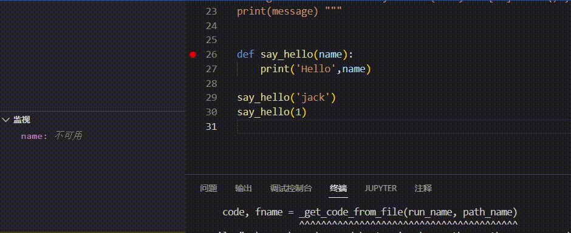

- work schedule#todo
	- DONE 《老友记》第10季-3
	  :LOGBOOK:
	  CLOCK: [2022-10-28 Fri 11:31:23]--[2022-10-28 Fri 11:31:24] =>  00:00:01
	  CLOCK: [2022-10-28 Fri 11:31:24]
	  CLOCK: [2022-10-28 Fri 11:31:39]--[2022-10-28 Fri 11:31:39] =>  00:00:00
	  CLOCK: [2022-10-28 Fri 12:04:44]--[2022-10-28 Fri 12:04:45] =>  00:00:01
	  CLOCK: [2022-10-28 Fri 12:04:45]--[2022-10-28 Fri 12:05:05] =>  00:00:20
	  :END:
	- DONE C语言-指针 下午
	  :LOGBOOK:
	  CLOCK: [2022-10-28 Fri 14:49:39]
	  CLOCK: [2022-10-28 Fri 14:49:42]
	  CLOCK: [2022-10-28 Fri 14:49:46]--[2022-10-28 Fri 15:37:17] =>  00:47:31
	  :END:
	- DONE Pyhton Day02 >[🍅 60min](#agenda-pomo://?t=p-1666948030208-2400%2Cp-1666948085016-1200)
	  :LOGBOOK:
	  CLOCK: [2022-10-28 Fri 15:54:35]
	  CLOCK: [2022-10-28 Fri 15:54:44]--[2022-10-28 Fri 17:02:42] =>  01:07:58
	  :END:
	- DONE C语言 指针 晚上 >[🍅 70min](#agenda-pomo://?t=p-1666960732033-1800%2Cf-1666960773397-2400)
	  :LOGBOOK:
	  CLOCK: [2022-10-28 Fri 20:16:10]
	  CLOCK: [2022-10-28 Fri 20:16:21]--[2022-10-28 Fri 20:38:44] =>  00:22:23
	  CLOCK: [2022-10-28 Fri 20:39:16]--[2022-10-28 Fri 21:46:05] =>  01:06:49
	  :END:
- Python Day02#python_course
	- 函数定义和调用
	  ```Python
	  def print_darwing(): # 定义函数的格式 def 名称（变量）:
	      print('   #')    # 		函数体 
	      print('  ##')
	      print(' ###')
	      print('####')
	  
	  print_darwing()     # 函数的调用
	  ```
	- debug工具的使用：设置断点
	- 函数的实参和形参
	  ```python
	  def say_hello(name):
	      print('Hello',name)
	  
	  say_hello('jack')
	  say_hello(1)
	  
	  ```
	  
	- 函数返回值：return 数据
		- 函数没有return,默认返回None
	- ```python
	  def my_sum():
	      a=input('Please input number')
	      b=input('Please input number')
	      return int(a)+int(b)			# 类型转为int
	  
	  s=my_sum()
	  print(s)
	  ```
-