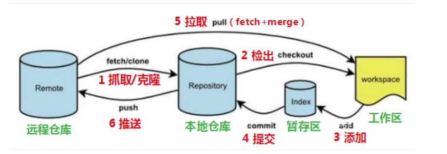

- schedule#todo
	- LATER C语言 内存管理
	- LATER git
- Git  #common
	- **每次更换分支必须提交，否则代码将丢失，找起来很麻烦**
	- 基本操作，每次更改完之后都需要`git add .`  `git commit -m " "`
		- 
		- `git status`查看文件状态
		  `git init` - 初始化仓库。
		  `git add .` - 添加文件到暂存区。
		  `git commit -m "注释"` - 将暂存区内容添加到仓库中。
		  `git log` `git-log`查看日志
		  `git reset --hard 版本标志 `回退版本
	- 分支
		- `git branch 分支名`创建分支
		  `git branch` 查看分支，HEAD表示所在分支
		  `git branch -d 分支名`删除分支
		  `git branch -D 分支名`强制删除
		  `git checkout 分支名` 切换分支
		  `git checkout -b 分支名`创建并切换分支
		  `git merge 分支名称`把分支名合并到当前分支
	- 远程部署(码云)
		- `ssh-keygen -t rsa` 生成ssh公钥
		       不断回车，如果存在公钥则自动覆盖
		- `cat ~/.ssh/id_rsa.pub` 获取公钥
		- `ssh -T git@gitee.com`验证配置是否成功
		- `git remote add origin 仓库地址` origin是远端名称
		- `git remote`查看远程仓库
		- `git push --set-upstream origin master:master`  `git push [-f] [--set-upstream] [远端名称 [本地分支名][:远端分支名] ]`
			- `--set-upstream`表示绑定分支，之后直接就可以`git push`
		- `git push origin master`本地和远端分支名相同就可以只写一个
	- 从远程仓库克隆
		- `git clone ssh克隆网址 自定义名称` 克隆到本地
	- 抓取和拉取
		- `git fetch`抓取远端更新
		  `git merge` 本地和远端合并
		- `git pull`抓取远端更新并合并
-