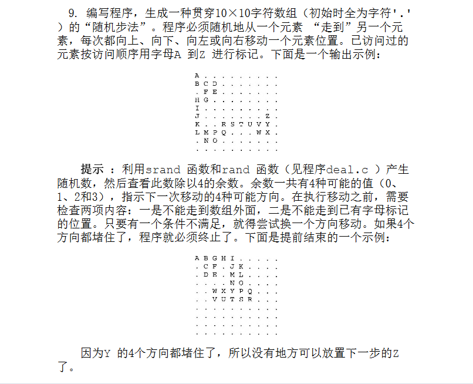

- schedule#todo
	- DONE C语言高级
	- LATER 线性代数
	- DONE 数学
	- LATER python
	- LATER 英语
- [[基本类型]]#c
- [[数组]]#c
	- 
	- ```c
	  //8.9	
	  	char w[10][10] = { 0 };
	  	int x, y, dir;
	  	int flag[4] = { 0 };//被字母(或跳出数组)包围标志
	  	char ch = 'A';
	  	int sum = 0;
	  	for (int i = 0; i < 10; i++)
	  		for (int j = 0; j < 10; j++)
	  			w[i][j] = '.';
	  	srand((unsigned int)time(NULL));
	  	x = 0;
	  	y = 0;
	  	w[x][y] = ch;
	  	while (w[x][y] != 'Z')
	  	{
	  	start:
	  		//计算标志是否为4，及四周同时存在字母
	  		//sum清0
	  		sum = 0;
	  		for (int i = 0; i < 4; i++)
	  			sum += flag[i];
	  		if (sum == 4)
	  			break;
	  		dir = rand() % 4;
	  		switch (dir)
	  		{
	  		case 0:
	  			x -= 1;
	  			//判断是否跳出数组，或下个地点是否已经走过
	  			if (x < 0 || w[x][y] != '.')
	  			{
	  				flag[0] = 1;
	  				x += 1;
	  				goto start;
	  			}
	  			break;
	  		case 1:
	  			x += 1;
	  			if (x > 9 || w[x][y] != '.')
	  			{
	  				flag[1] = 1;
	  				x -= 1;
	  				goto start;
	  			}
	  			break;
	  		case 2:
	  			y -= 1;
	  			if (y < 0 || w[x][y] != '.')
	  			{
	  				flag[2] = 1;
	  				y += 1;
	  				goto start;
	  			}
	  			break;
	  		case 3:
	  			y += 1;
	  			if (y > 9 || w[x][y] != '.')
	  			{
	  				flag[3] = 1;
	  				y -= 1;
	  				goto start;
	  			}
	  			break;
	  		}
	  		//标志清0
	  		for (int i = 0; i < 4; i++)
	  			flag[i] = 0;
	  		//轨迹字母自加后赋值
	  		ch++;
	  		w[x][y] = ch;
	  	}
	  	for (int i = 0; i < 10; i++)
	  	{
	  		for (int j = 0; j < 10; j++)
	  			printf("%c ", w[i][j]);
	  		printf("\n");
	  	}
	  ```
	  #star